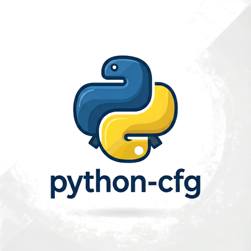

<p align="center">
  <a href="https://pypi.org/project/conditional-method"></a>
</p>
<p align="center">
    <em>Conditionally select which method implementation survives class creation — decided at runtime, at startup, or at class build time.</em>
</p>
<p align="center">
<a href="https://github.com/jymchng/conditional-method/actions/workflows/ci.yml" target="_blank"></a>
<a href="https://pypi.org/project/conditional-method" target="_blank"></a>
<a href="https://pypi.org/project/conditional-method" target="_blank"></a>
<a href="https://pypi.org/project/conditional-method" target="_blank"></a>
<a href="https://pypi.org/project/conditional-method" target="_blank"></a>
</p>

---

**Documentation**: <a href="https://jymchng.github.io/conditional-method/" target="_blank">https://jymchng.github.io/conditional-method/</a>

**Source Code**: <a href="https://github.com/jymchng/conditional-method" target="_blank">https://github.com/jymchng/conditional-method</a>

---

A decorator `@cfg` (aliases: `@if_`, `@cm`, `@conditional_method`) that selects a
method implementation among those that are identically named on a class — during
class build time. Only the selected method remains in the class attributes, i.e.
the class is *well-formed*. The same decorators also work on module-level
functions and on classes themselves.

- **Conditional method selection** — define several implementations of the same
  name; the one whose condition is true survives.
- **Decided when you need it** — evaluate conditions at import/startup time
  (boolean) or lazily per call (callable).
- **Clean class design** — keep conditional logic out of the method body; the
  resulting class exposes only the chosen implementation.
- **Conditional decorators** — `@cfg_attr` applies decorators only when a
  condition is true.
- **Type-safe** — ships `py.typed` and a stable public API.
- **Zero runtime dependencies**.
- **Fast** — the entire implementation is a C extension (`cfg._c`) built
  against the Python Limited API (abi3): a single `cp39-abi3` wheel covers
  CPython 3.9–3.14.
- **Debuggable** — optional debug logging for troubleshooting.

## Requirements

Python 3.9+ (CPython 3.9, 3.10, 3.11, 3.12, 3.13, 3.14).

## Installation

<div class="termy">

```console
$ pip install conditional-method

---> 100%
Successfully installed conditional-method
```

</div>

## Example

### Pick one implementation per environment

```python
import os

from cfg import cfg

ENVIRONMENT = os.environ.get("ENV", "development")


class Worker:
    @cfg(condition=ENVIRONMENT == "production")
    def work(self, *args, **kwargs):
        return "production"

    @cfg(condition=ENVIRONMENT == "development")
    def work(self, *args, **kwargs):
        return "development"

    @cfg(condition=ENVIRONMENT == "staging")
    def work(self, *args, **kwargs):
        return "staging"


worker = Worker()
print(worker.work())
# development

print(Worker.__dict__)
# Only ONE `work` survives — the class is well-formed:
# {'__module__': '__main__', 'work': <function Worker.work at 0x...>, ...}
```

### Callable conditions — decided lazily, per call

```python
import os

from cfg import cfg


class DatabaseConnector:
    @cfg(condition=lambda f: os.environ.get("ENV") == "production")
    def connect(self, config):
        print("Connecting to the production database...")

    @cfg(condition=lambda f: os.environ.get("ENV") == "development")
    def connect(self, config):
        print("Connecting to the development database...")
```

When a condition is false, the corresponding function/class raises `TypeError`
if called or instantiated. If no condition is true, the last false one is kept
as the raiser. If several conditions are true, the **last** one that evaluated
true wins.

### Apply decorators conditionally with `@cfg_attr`

```python
import os

from cfg import cfg_attr

os.environ["FEATURE_FLAG"] = "enabled"


@cfg_attr(
    condition=os.environ.get("FEATURE_FLAG") == "enabled",
    decorators=[log_calls, cache_result],
)
def experimental_feature(value): ...
```

Decorators are applied in order — but only when `condition` is true.

More examples live in the `examples/` directory and in the
[documentation](https://jymchng.github.io/conditional-method/).

## Debugging

Enable debug logging by setting the environment variable
`__conditional_method_debug__` to any value other than `"false"`:

```bash
# Linux / macOS
export __conditional_method_debug__=true

# Windows
set __conditional_method_debug__=true
```

## License

This project is licensed under the terms of the MIT license.

## Links

- **Documentation**: <https://jymchng.github.io/conditional-method/>
- **Changelog**: [CHANGELOG.md](CHANGELOG.md)
- **Security**: [SECURITY.md](SECURITY.md)
- **Source**: <https://github.com/jymchng/conditional-method>
- **PyPI**: <https://pypi.org/project/conditional-method>
